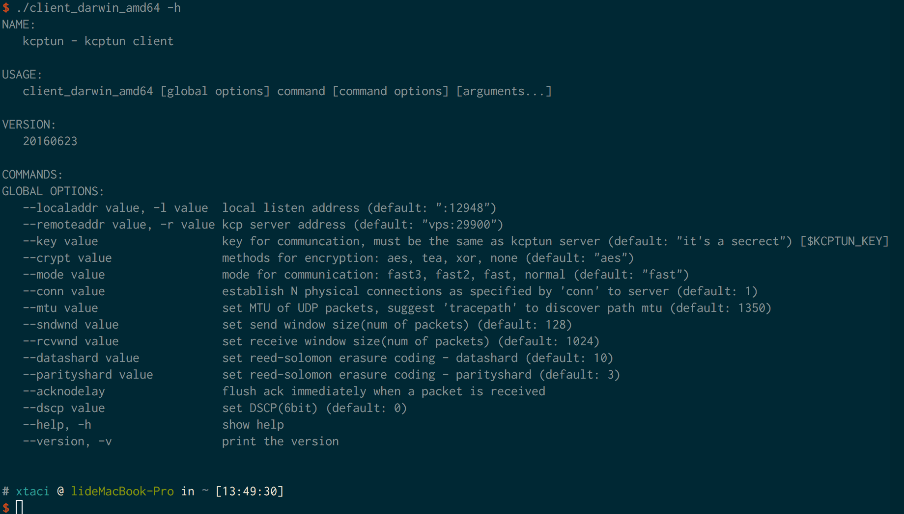
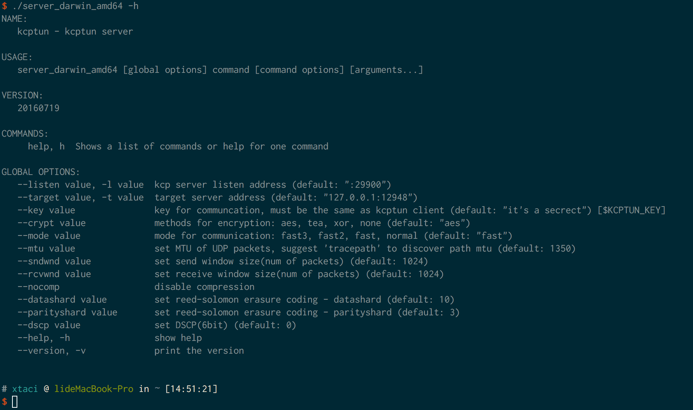

#  
[![GoDoc][1]][2] [![Release][13]][14] [![Powered][17]][18] [![Build Status][3]][4] [![Go Report Card][5]][6] [![Downloads][15]][16] 
[1]: https://godoc.org/github.com/xtaci/kcptun?status.svg
[2]: https://godoc.org/github.com/xtaci/kcptun
[3]: https://travis-ci.org/xtaci/kcptun.svg?branch=master
[4]: https://travis-ci.org/xtaci/kcptun
[5]: https://goreportcard.com/badge/github.com/xtaci/kcptun
[6]: https://goreportcard.com/report/github.com/xtaci/kcptun
[7]: https://img.shields.io/badge/license-MIT-blue.svg
[8]: https://raw.githubusercontent.com/xtaci/kcptun/master/LICENSE.md
[9]: https://img.shields.io/github/stars/xtaci/kcptun.svg
[10]: https://github.com/xtaci/kcptun/stargazers
[11]: https://img.shields.io/github/forks/xtaci/kcptun.svg
[12]: https://github.com/xtaci/kcptun/network
[13]: https://img.shields.io/github/release/xtaci/kcptun.svg
[14]: https://github.com/xtaci/kcptun/releases/latest
[15]: https://img.shields.io/github/downloads/xtaci/kcptun/total.svg?maxAge=2592000
[16]: https://github.com/xtaci/kcptun/releases
[17]: https://img.shields.io/badge/KCP-Powered-blue.svg
[18]: https://github.com/skywind3000/kcp
[19]: https://img.shields.io/docker/pulls/xtaci/kcptun.svg?maxAge=2592000
[20]: https://hub.docker.com/r/xtaci/kcptun/

[English](README.en.md)

TCP流转换为KCP+UDP流，:zap:***[官方下载地址](https://github.com/xtaci/kcptun/releases/latest)***:zap:工作示意图：  


***kcptun是[kcp-go](https://github.com/xtaci/kcp-go)实现的一个端口转发工具，可以用于任意tcp网络程序的传输承载(尤其用于udp游戏通信测试)，用于优化丢包环境下的网络流畅度。***   

### *快速设定* :lollipop:
```
服务器: ./server_linux_amd64 -t "127.0.0.1:1080" -l ":554" -mode fast2  // 转发到本地1080端口
客户端: ./client_darwin_amd64 -r "服务器IP地址:554" -l ":1080" -mode fast2    // 监听本地1080端口
```

### *使用方法* :lollipop:
在Mac OS X El Capitan下的帮助输出: 




### *适用范围限定* :lollipop:   
1. 实时网络游戏的数据传输        
2. 跨运营商的流量传输               
3. 其他高丢包通信链路的TCP承载      

### *推荐参数* :lollipop: 
```
适用大部分ADSL接入（非对称上下行）的参数（实验环境电信100M ADSL）
SERVER:   -mtu 1400 -sndwnd 2048 -rcvwnd 2048 -mode fast2
CLIENT:   -mtu 1400 -sndwnd 256 -rcvwnd 2048 -mode fast2 -dscp 46
```

*简易调优方法*：
> 第一步：同时在两端逐步增大client rcvwnd和server sndwnd;        
> 第二步：尝试下载，观察如果带宽利用率接近物理带宽则停止（***注意，SERVER的发送速率不能超过ADSL下行带宽***)，否则跳转到第一步。       

*巭孬嫑乱动*        

### *DSCP* :lollipop: 
DSCP差分服务代码点（Differentiated Services Code Point），IETF于1998年12月发布了Diff-Serv（Differentiated Service）的QoS分类标准。它在每个数据包IP头部的服务类别TOS标识字节中，利用已使用的6比特和未使用的2比特，通过编码值来区分优先级。     
常用DSCP值可以参考[Wikipedia DSCP](https://en.wikipedia.org/wiki/Differentiated_services#Commonly_used_DSCP_values)，至于有没有用，完全取决于数据包经过的设备。

### *内置模式* :lollipop: 
响应速度:     
*fast3 >* ***[fast2]*** *> fast > normal > default*        
有效载荷比:     
*default > normal > fast >* ***[fast2]*** *> fast3*       
中间mode参数比较均衡，总之就是越快越浪费带宽，推荐模式 ***fast2***         
更高级的 ***手动档*** 需要理解KCP协议，并通过 ***隐藏参数*** 调整，例如:
```
 -mode manual -nodelay 1 -resend 2 -nc 1 -interval 20
```

### *前向纠错* :lollipop: 
前向纠错采用Reed Solomon纠删码, 它的基本原理如下： 给定n个数据块d1, d2,…, dn，n和一个正整数m， RS根据n个数据块生成m个校验块， c1, c2,…, cm。 对于任意的n和m， 从n个原始数据块和m 个校验块中任取n块就能解码出原始数据， 即RS最多容忍m个数据块或者校验块同时丢失。


通过```-datashard 10 -parityshard 3``` 可以调整Reed Solomon参数。

### *Snappy数据流压缩* :lollipop: 
> Snappy is a compression/decompression library. It does not aim for maximum
> compression, or compatibility with any other compression library; instead,
> it aims for very high speeds and reasonable compression. For instance,
> compared to the fastest mode of zlib, Snappy is an order of magnitude faster
> for most inputs, but the resulting compressed files are anywhere from 20% to
> 100% bigger.

Reference: http://google.github.io/snappy/

### *SNMP* :lollipop:
```go
// Snmp defines network statistics indicator
type Snmp struct {
	BytesSent        uint64 // payload bytes sent
	BytesReceived    uint64
	MaxConn          uint64
	ActiveOpens      uint64
	PassiveOpens     uint64
	CurrEstab        uint64
	InErrs           uint64
	InCsumErrors     uint64 // checksum errors
	InSegs           uint64
	OutSegs          uint64
	OutBytes         uint64 // udp bytes sent
	RetransSegs      uint64
	FastRetransSegs  uint64
	EarlyRetransSegs uint64
	LostSegs         uint64
	RepeatSegs       uint64
	FECRecovered     uint64
	FECErrs          uint64
	FECSegs          uint64 // fec segments received
}
```

使用```kill -SIGUSR1 pid``` 可以在控制台打印出SNMP信息，通常用于精细调整***当前链路的有效载荷比***。        
观察```RetransSegs,FastRetransSegs,LostSegs,OutSegs```这几者的数值比例，用于参考调整```-mode manual,fec```的参数。        

### *性能对比* :lollipop:
```
root@vultr:~# iperf -s
------------------------------------------------------------
Server listening on TCP port 5001
TCP window size: 4.00 MByte (default)
------------------------------------------------------------
[  4] local 172.7.7.1 port 5001 connected with 172.7.7.2 port 55453
[ ID] Interval       Transfer     Bandwidth
[  4]  0.0-18.0 sec  5.50 MBytes  2.56 Mbits/sec     <-- connection via kcptun
[  5] local 45.32.xxx.xxx port 5001 connected with 218.88.xxx.xxx port 17220
[  5]  0.0-17.9 sec  2.12 MBytes   997 Kbits/sec     <-- direct connnection via tcp
```

### *免责申明* :warning:
用户以各种方式使用本软件（包括但不限于修改使用、直接使用、通过第三方使用）的过程中，不得以任何方式利用本软件直接或间接从事违反中国法律、以及社会公德的行为。软件的使用者需对自身行为负责，因使用软件引发的一切纠纷，由使用者承担全部法律及连带责任。作者不承担任何法律及连带责任。       

对免责声明的解释、修改及更新权均属于作者本人所有。

### *捐赠* :dollar:
          

对该项目的捐款将用于[gonet/2](http://gonet2.github.io/)游戏服务器框架的研发。

### *参考资料* :paperclip:
1. https://github.com/skywind3000/kcp -- KCP - A Fast and Reliable ARQ Protocol.
2. https://github.com/klauspost/reedsolomon -- Reed-Solomon Erasure Coding in Go.
3. https://en.wikipedia.org/wiki/Differentiated_services -- DSCP.
4. http://google.github.io/snappy/ -- A fast compressor/decompressor.
5. https://www.backblaze.com/blog/reed-solomon/ -- Reed-Solomon Explained.
6. http://www.qualcomm.cn/products/raptorq -- RaptorQ Forward Error Correction Scheme for Object Delivery.
7. https://en.wikipedia.org/wiki/PBKDF2 -- Key stretching.
8. http://blog.appcanary.com/2016/encrypt-or-compress.html -- Should you encrypt or compress first?
9. https://github.com/hashicorp/yamux -- Connection multiplexing library.
10. https://tools.ietf.org/html/rfc6937 -- Proportional Rate Reduction for TCP.
11. https://tools.ietf.org/html/rfc5827 -- Early Retransmit for TCP and Stream Control Transmission Protocol (SCTP).
12. http://http2.github.io/ -- What is HTTP/2?
