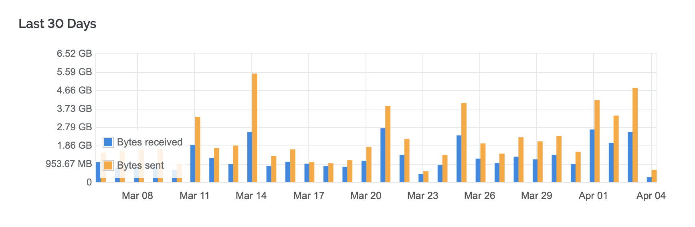
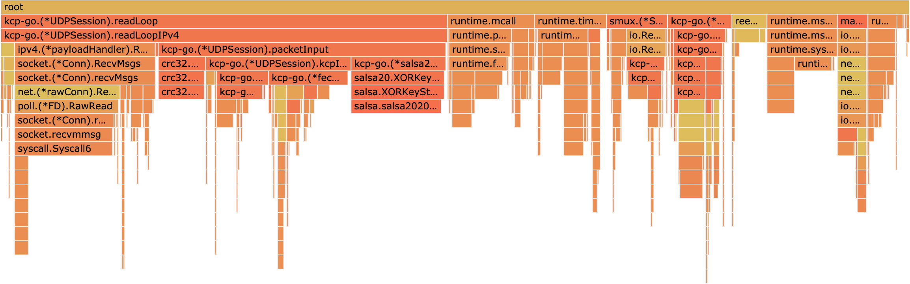
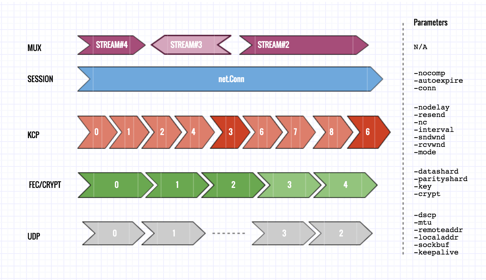
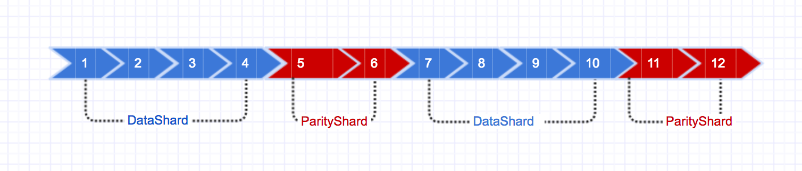

#  

[![Release][13]][14] [![Powered][17]][18] [![MIT licensed][11]][12] [![Build Status][3]][4] [![Go Report Card][5]][6] [![Downloads][15]][16] [![Docker][1]][2] 

[1]: https://img.shields.io/docker/pulls/xtaci/kcptun
[2]: https://hub.docker.com/r/xtaci/kcptun
[3]: https://travis-ci.org/xtaci/kcptun.svg?branch=master
[4]: https://travis-ci.org/xtaci/kcptun
[5]: https://goreportcard.com/badge/github.com/xtaci/kcptun
[6]: https://goreportcard.com/report/github.com/xtaci/kcptun
[11]: https://img.shields.io/github/license/xtaci/kcptun
[12]: LICENSE.md
[13]: https://img.shields.io/github/v/release/xtaci/kcptun?color=orange
[14]: https://github.com/xtaci/kcptun/releases/latest
[15]: https://img.shields.io/github/downloads/xtaci/kcptun/total.svg?maxAge=1800&color=orange
[16]: https://github.com/xtaci/kcptun/releases
[17]: https://img.shields.io/badge/KCP-Powered-blue.svg
[18]: https://github.com/skywind3000/kcp


> *Disclaimer: kcptun maintains a single website — [github.com/xtaci/kcptun](https://github.com/xtaci/kcptun). Any websites other than [github.com/xtaci/kcptun](https://github.com/xtaci/kcptun) are not endorsed by xtaci.*

### Requirements

| Target | Minimum | Recommended |
| --- | --- | --- |
| System | aix darwin dragonfly freebsd linux netbsd openbsd solaris windows | linux |
| Memory | >20MB | >32MB |
| CPU | ANY | amd64 with AES-NI & AVX2 |


### QuickStart

Increase the number of open files on your server, as:

`ulimit -n 65535`, or write it in `~/.bashrc`.

Suggested `sysctl.conf` parameters for better handling of UDP packets:

```
net.core.rmem_max=26214400 // BDP - bandwidth delay product
net.core.rmem_default=26214400
net.core.wmem_max=26214400
net.core.wmem_default=26214400
net.core.netdev_max_backlog=2048 // proportional to -rcvwnd
```

You can also increase the per-socket buffer by adding parameter(default 4MB):
```
-sockbuf 16777217
```
for **slow processors**, increasing this buffer is **CRITICAL** to receive packets properly.

Download a corresponding one from precompiled [Releases](https://github.com/xtaci/kcptun/releases).

```
KCP Client: ./client_darwin_amd64 -r "KCP_SERVER_IP:4000" -l ":8388" -mode fast3 -nocomp -autoexpire 900 -sockbuf 16777217 -dscp 46
KCP Server: ./server_linux_amd64 -t "TARGET_IP:8388" -l ":4000" -mode fast3 -nocomp -sockbuf 16777217 -dscp 46
```
The above commands will establish port forwarding channel for 8388/tcp as:

> Application -> **KCP Client(8388/tcp) -> KCP Server(4000/udp)** -> Target Server(8388/tcp) 

which tunnels the original connection:

> Application -> Target Server(8388/tcp) 

### Build from source

```
$ git clone https://github.com/xtaci/kcptun.git
$ cd kcptun
$ ./build-release.sh
$ cd build
```

All precompiled releases are genereated from `build-release.sh` script.

### Performance

  





> Practical bandwidth graph with parameters:  -mode fast3 -ds 10 -ps 3


### Basic Tuning Guide

#### Improving Thoughput

> **Q: I have a high speed network link, how to reach the maximum bandwidth?**        

> **A:** Increase `-rcvwnd` on KCP Client and `-sndwnd` on KCP Server **simultaneously & gradually**, the mininum one decides the maximum transfer rate of the link, as `wnd * mtu / rtt`; Then try downloading something and to see if it meets your requirements. 
(mtu is adjustable by `-mtu`)

#### Improving Latency

> **Q: I'm using kcptun for game, I don't want any lag happening.**    

> **A:** Lag means packet loss for most of the time, lags can be improved by changing `-mode`.

> eg: `-mode fast3`    

> Aggresiveness/Responsiveness on retransmission for embedded modes are:

> *fast3 > fast2 > fast > normal > default*

#### HOLB

Since streams are multiplexed into a single physical channel, head of line blocking may appear under certain circumstances, by
increasing `-smuxbuf` to a larger value (default 4MB) may mitigate this problem, obviously this will costs more memory.

For versions >= v20190924, you can switch to smux version 2, smux v2 has options to limit per-stream memory usage, now set `-smuxver 2` to enable smux v2, and adjust `-streambuf` to limit per-stream memory usage, eg: `-streambuf 2097152` can limit per-stream memory usage to 2MB. By limiting stream buffer on the receiver side, a back-pressure will be conducted to the sender and limits reading, and finally prevent source from sending too much data to occupy every bits of buffer along the link. (Setting -smuxver **MUST** be **IDENTICAL** on both side, default is 1. )

#### Slow Devices

kcptun made use of **ReedSolomon-Codes** to recover lost packets, which requires massive amount of computation, a low-end ARM device cannot satisfy kcptun well. To unleash the full potential of kcptun, a multi-core x86 homeserver CPU like AMD Opteron is recommended.
If you insist on running under some ARM routers, you'd better turn off `FEC` and use `salsa20` as the encryption method.

### Expert Tuning Guide

#### Overview

<p align="left"></p>

#### Usage

```
➜  ~ ./client_linux_amd64 -h
NAME:
   kcptun - client(with SMUX)

USAGE:
   client_linux_amd64 [global options] command [command options] [arguments...]

VERSION:
   20190924

COMMANDS:
   help, h  Shows a list of commands or help for one command

GLOBAL OPTIONS:
   --localaddr value, -l value      local listen address (default: ":12948")
   --remoteaddr value, -r value     kcp server address, eg: "IP:29900" a for single port, "IP:minport-maxport" for port range (default: "vps:29900")
   --key value                      pre-shared secret between client and server (default: "it's a secrect") [$KCPTUN_KEY]
   --crypt value                    aes, aes-128, aes-192, salsa20, blowfish, twofish, cast5, 3des, tea, xtea, xor, sm4, none (default: "aes")
   --mode value                     profiles: fast3, fast2, fast, normal, manual (default: "fast")
   --conn value                     set num of UDP connections to server (default: 1)
   --autoexpire value               set auto expiration time(in seconds) for a single UDP connection, 0 to disable (default: 0)
   --scavengettl value              set how long an expired connection can live (in seconds) (default: 600)
   --mtu value                      set maximum transmission unit for UDP packets (default: 1350)
   --sndwnd value                   set send window size(num of packets) (default: 128)
   --rcvwnd value                   set receive window size(num of packets) (default: 512)
   --datashard value, --ds value    set reed-solomon erasure coding - datashard (default: 10)
   --parityshard value, --ps value  set reed-solomon erasure coding - parityshard (default: 3)
   --dscp value                     set DSCP(6bit) (default: 0)
   --nocomp                         disable compression
   --sockbuf value                  per-socket buffer in bytes (default: 4194304)
   --smuxver value                  specify smux version, available 1,2 (default: 1)
   --smuxbuf value                  the overall de-mux buffer in bytes (default: 4194304)
   --streambuf value                per stream receive buffer in bytes, smux v2+ (default: 2097152)
   --keepalive value                seconds between heartbeats (default: 10)
   --snmplog value                  collect snmp to file, aware of timeformat in golang, like: ./snmp-20060102.log
   --snmpperiod value               snmp collect period, in seconds (default: 60)
   --log value                      specify a log file to output, default goes to stderr
   --quiet                          to suppress the 'stream open/close' messages
   --tcp                            to emulate a TCP connection(linux)
   -c value                         config from json file, which will override the command from shell
   --help, -h                       show help
   --version, -v                    print the version
   
➜  ~ ./server_linux_amd64 -h
NAME:
   kcptun - server(with SMUX)

USAGE:
   server_linux_amd64 [global options] command [command options] [arguments...]

VERSION:
   20190924

COMMANDS:
   help, h  Shows a list of commands or help for one command

GLOBAL OPTIONS:
   --listen value, -l value         kcp server listen address, eg: "IP:29900" for a single port, "IP:minport-maxport" for port range (default: ":29900")
   --target value, -t value         target server address, or path/to/unix_socket (default: "127.0.0.1:12948")
   --key value                      pre-shared secret between client and server (default: "it's a secrect") [$KCPTUN_KEY]
   --crypt value                    aes, aes-128, aes-192, salsa20, blowfish, twofish, cast5, 3des, tea, xtea, xor, sm4, none (default: "aes")
   --mode value                     profiles: fast3, fast2, fast, normal, manual (default: "fast")
   --mtu value                      set maximum transmission unit for UDP packets (default: 1350)
   --sndwnd value                   set send window size(num of packets) (default: 1024)
   --rcvwnd value                   set receive window size(num of packets) (default: 1024)
   --datashard value, --ds value    set reed-solomon erasure coding - datashard (default: 10)
   --parityshard value, --ps value  set reed-solomon erasure coding - parityshard (default: 3)
   --dscp value                     set DSCP(6bit) (default: 0)
   --nocomp                         disable compression
   --sockbuf value                  per-socket buffer in bytes (default: 4194304)
   --smuxver value                  specify smux version, available 1,2 (default: 1)
   --smuxbuf value                  the overall de-mux buffer in bytes (default: 4194304)
   --streambuf value                per stream receive buffer in bytes, smux v2+ (default: 2097152)
   --keepalive value                seconds between heartbeats (default: 10)
   --snmplog value                  collect snmp to file, aware of timeformat in golang, like: ./snmp-20060102.log
   --snmpperiod value               snmp collect period, in seconds (default: 60)
   --pprof                          start profiling server on :6060
   --log value                      specify a log file to output, default goes to stderr
   --quiet                          to suppress the 'stream open/close' messages
   --tcp                            to emulate a TCP connection(linux)
   -c value                         config from json file, which will override the command from shell
   --help, -h                       show help
   --version, -v                    print the version
```

#### Multiport Dialer

kcptun supports multi-port dialer like below:

```
client: --remoteaddr IP:minport-maxport
server: --listen IP:minport-maxport

eg:
client: --remoteaddr IP:3000-4000
server: --listen 0.0.0.0:3000-4000
```
by specifying port-range, kcptun will automatically switch to next random port within port-range when establishing each new connection.


#### Forward Error Correction

In coding theory, the [Reed–Solomon code](https://en.wikipedia.org/wiki/Reed%E2%80%93Solomon_error_correction) belongs to the class of non-binary cyclic error-correcting codes. The Reed–Solomon code is based on univariate polynomials over finite fields.

It is able to detect and correct multiple symbol errors. By adding t check symbols to the data, a Reed–Solomon code can detect any combination of up to t erroneous symbols, or correct up to ⌊t/2⌋ symbols. As an erasure code, it can correct up to t known erasures, or it can detect and correct combinations of errors and erasures. Furthermore, Reed–Solomon codes are suitable as multiple-burst bit-error correcting codes, since a sequence of b + 1 consecutive bit errors can affect at most two symbols of size b. The choice of t is up to the designer of the code, and may be selected within wide limits.



#### DSCP

Differentiated services or DiffServ is a computer networking architecture that specifies a simple, scalable and coarse-grained mechanism for classifying and managing network traffic and providing quality of service (QoS) on modern IP networks. DiffServ can, for example, be used to provide low-latency to critical network traffic such as voice or streaming media while providing simple best-effort service to non-critical services such as web traffic or file transfers.

DiffServ uses a 6-bit differentiated services code point (DSCP) in the 8-bit differentiated services field (DS field) in the IP header for packet classification purposes. The DS field and ECN field replace the outdated IPv4 TOS field.

setting each side with ```-dscp value```, Here are some [Commonly used DSCP values](https://en.wikipedia.org/wiki/Differentiated_services#Commonly_used_DSCP_values).

#### Cryptanalysis

kcptun is shipped with builtin packet encryption powered by various block encryption algorithms and works in [Cipher Feedback Mode](https://en.wikipedia.org/wiki/Block_cipher_mode_of_operation#Cipher_Feedback_(CFB)), for each packet to be sent, the encryption process will start from encrypting a [nonce](https://en.wikipedia.org/wiki/Cryptographic_nonce) from the [system entropy](https://en.wikipedia.org/wiki//dev/random), so encryption to same plaintexts never leads to a same ciphertexts thereafter.

The contents of the packets are completely anonymous with encryption, including the headers(FEC,KCP), checksums and contents. Note that, no matter which encryption method you choose on you upper layer, if you disable encryption by specifying `-crypt none` to kcptun, the transmit will be insecure somehow, since the header is ***PLAINTEXT*** to everyone it would be susceptible to header tampering, such as jamming the *sliding window size*, *round-trip time*, *FEC property* and *checksums*. ```aes-128``` is suggested for minimal encryption since modern CPUs are shipped with [AES-NI](https://en.wikipedia.org/wiki/AES_instruction_set) instructions and performs even better than `salsa20`(check the table below).

Other possible attacks to kcptun includes: a) [traffic analysis](https://en.wikipedia.org/wiki/Traffic_analysis), dataflow on specific websites may have pattern while interchanging data, but this type of eavesdropping has been mitigated by adapting [smux](https://github.com/xtaci/smux) to mix data streams so as to introduce noises, perfect solution to this has not appeared yet, theroretically by shuffling/mixing messages on larger scale network may mitigate this problem.  b) [replay attack](https://en.wikipedia.org/wiki/Replay_attack), since the asymmetrical encryption has not been introduced into kcptun for some reason, capturing the packets and replay them on a different machine is possible, (notice: hijacking the session and decrypting the contents is still *impossible*), so upper layers should contain a asymmetrical encryption system to guarantee the authenticity of each message(to process message exactly once), such as HTTPS/OpenSSL/LibreSSL, only by signing the requests with private keys can eliminate this type of attack. 

Important: 
1. `-crypt` and `-key` must be the same on both KCP Client & KCP Server.
2. `-crypt xor` is also insecure and vulnerable to [known-plaintext attack](https://en.wikipedia.org/wiki/Known-plaintext_attack), do not use this unless you know what you are doing. (*cryptanalysis note: any type of [counter mode](https://en.wikipedia.org/wiki/Block_cipher_mode_of_operation#Counter_(CTR)) is insecure in packet encryption due to the shorten of counter period and leads to iv/nonce collision*)

Benchmarks for crypto algorithms supported by kcptun:

```
BenchmarkSM4-4                 	   50000	     32087 ns/op	  93.49 MB/s	       0 B/op	       0 allocs/op
BenchmarkAES128-4              	  500000	      3274 ns/op	 916.15 MB/s	       0 B/op	       0 allocs/op
BenchmarkAES192-4              	  500000	      3587 ns/op	 836.34 MB/s	       0 B/op	       0 allocs/op
BenchmarkAES256-4              	  300000	      3828 ns/op	 783.60 MB/s	       0 B/op	       0 allocs/op
BenchmarkTEA-4                 	  100000	     15359 ns/op	 195.32 MB/s	       0 B/op	       0 allocs/op
BenchmarkXOR-4                 	20000000	        90.2 ns/op	33249.02 MB/s	       0 B/op	       0 allocs/op
BenchmarkBlowfish-4            	   50000	     26885 ns/op	 111.58 MB/s	       0 B/op	       0 allocs/op
BenchmarkNone-4                	30000000	        45.8 ns/op	65557.11 MB/s	       0 B/op	       0 allocs/op
BenchmarkCast5-4               	   50000	     34370 ns/op	  87.29 MB/s	       0 B/op	       0 allocs/op
Benchmark3DES-4                	   10000	    117893 ns/op	  25.45 MB/s	       0 B/op	       0 allocs/op
BenchmarkTwofish-4             	   50000	     33477 ns/op	  89.61 MB/s	       0 B/op	       0 allocs/op
BenchmarkXTEA-4                	   30000	     45825 ns/op	  65.47 MB/s	       0 B/op	       0 allocs/op
BenchmarkSalsa20-4             	  500000	      3282 ns/op	 913.90 MB/s	       0 B/op	       0 allocs/op
```

Benchmark result from openssl

```
$ openssl speed -evp aes-128-cfb
Doing aes-128-cfb for 3s on 16 size blocks: 157794127 aes-128-cfb's in 2.98s
Doing aes-128-cfb for 3s on 64 size blocks: 39614018 aes-128-cfb's in 2.98s
Doing aes-128-cfb for 3s on 256 size blocks: 9971090 aes-128-cfb's in 2.99s
Doing aes-128-cfb for 3s on 1024 size blocks: 2510877 aes-128-cfb's in 2.99s
Doing aes-128-cfb for 3s on 8192 size blocks: 310865 aes-128-cfb's in 2.98s
OpenSSL 1.0.2p  14 Aug 2018
built on: reproducible build, date unspecified
options:bn(64,64) rc4(ptr,int) des(idx,cisc,16,int) aes(partial) idea(int) blowfish(idx)
compiler: clang -I. -I.. -I../include  -fPIC -fno-common -DOPENSSL_PIC -DOPENSSL_THREADS -D_REENTRANT -DDSO_DLFCN -DHAVE_DLFCN_H -arch x86_64 -O3 -DL_ENDIAN -Wall -DOPENSSL_IA32_SSE2 -DOPENSSL_BN_ASM_MONT -DOPENSSL_BN_ASM_MONT5 -DOPENSSL_BN_ASM_GF2m -DSHA1_ASM -DSHA256_ASM -DSHA512_ASM -DMD5_ASM -DAES_ASM -DVPAES_ASM -DBSAES_ASM -DWHIRLPOOL_ASM -DGHASH_ASM -DECP_NISTZ256_ASM
The 'numbers' are in 1000s of bytes per second processed.
type             16 bytes     64 bytes    256 bytes   1024 bytes   8192 bytes
aes-128-cfb     847216.79k   850770.86k   853712.05k   859912.39k   854565.80k
```

The encrytion performance in kcptun is as fast as in openssl library(if not faster).


#### Memory Control

Routers, mobile devices are susceptible to memory consumption; by setting GOGC environment(eg: GOGC=20) will make the garbage collector to recycle faster.
Reference: https://blog.golang.org/go15gc

Primary memory allocation are done from a global buffer pool *xmit.Buf*, in kcp-go, when we need to allocate some bytes, we can get from that pool, and a *fixed-capacity* 1500 bytes(mtuLimit) will be returned, the *rx queue*, *tx queue* and *fec queue* all receive bytes from there, and they will return the bytes to the pool after using to prevent *unnecessary zer0ing* of bytes. 
The pool mechanism maintained a *high watermark* for slice objects, these *in-flight* objects from the pool will survive from the perodical garbage collection, meanwhile the pool kept the ability to return the memory to runtime if in idle, `-sndwnd`,`-rcvwnd`,`-ds`, `-ps`, these parameters affect this *high watermark*, the larger the value, the bigger the memory consumption will be.

`-smuxbuf` also affects the maximum memory consumption, this parameter maintains a subtle balance between *concurrency* and *resource*, you can increase this value(default 4MB) to boost concurrency if you have many clients to serve and you get a powerful server at the same time, and also you can decrease this value to serve only 1 or 2 clients and hope this program can run under some embedded SoC system with limited memory and only you can access. (Notice that the `-smuxbuf` value is not proprotional to concurrency, you need to test.)


#### Compression

kcptun has builtin snappy algorithms for compressing streams:

> Snappy is a compression/decompression library. It does not aim for maximum
> compression, or compatibility with any other compression library; instead,
> it aims for very high speeds and reasonable compression. For instance,
> compared to the fastest mode of zlib, Snappy is an order of magnitude faster
> for most inputs, but the resulting compressed files are anywhere from 20% to
> 100% bigger.

> Reference: http://google.github.io/snappy/

Compression may save bandwidth for **PLAINTEXT** data, it's quite useful for specific scenarios as cross-datacenter replications, by compressing the redologs in dbms or kafka-like message queues and then transfer the data streams across the continent can be much faster.

Compression is enabled by default, you can disable it by setting ```-nocomp``` on **BOTH** KCP Client & KCP Server **MUST** be **IDENTICAL**.

#### SNMP

```go
type Snmp struct {
    BytesSent        uint64 // bytes sent from upper level
    BytesReceived    uint64 // bytes received to upper level
    MaxConn          uint64 // max number of connections ever reached
    ActiveOpens      uint64 // accumulated active open connections
    PassiveOpens     uint64 // accumulated passive open connections
    CurrEstab        uint64 // current number of established connections
    InErrs           uint64 // UDP read errors reported from net.PacketConn
    InCsumErrors     uint64 // checksum errors from CRC32
    KCPInErrors      uint64 // packet iput errors reported from KCP
    InPkts           uint64 // incoming packets count
    OutPkts          uint64 // outgoing packets count
    InSegs           uint64 // incoming KCP segments
    OutSegs          uint64 // outgoing KCP segments
    InBytes          uint64 // UDP bytes received
    OutBytes         uint64 // UDP bytes sent
    RetransSegs      uint64 // accmulated retransmited segments
    FastRetransSegs  uint64 // accmulated fast retransmitted segments
    EarlyRetransSegs uint64 // accmulated early retransmitted segments
    LostSegs         uint64 // number of segs infered as lost
    RepeatSegs       uint64 // number of segs duplicated
    FECRecovered     uint64 // correct packets recovered from FEC
    FECErrs          uint64 // incorrect packets recovered from FEC
    FECParityShards  uint64 // FEC segments received
    FECShortShards   uint64 // number of data shards that's not enough for recovery
}
```

Sending a `SIGUSR1` signal to KCP Client or KCP Server will dump SNMP information to console, just like `/proc/net/snmp`. You can use this information to do fine-grained tuning.

### Manual Control

https://github.com/skywind3000/kcp/blob/master/README.en.md#protocol-configuration

`-mode manual -nodelay 1 -interval 20 -resend 2 -nc 1`

Low-level KCP configuration can be altered by using manual mode like above, make sure you really **UNDERSTAND** what these means before doing **ANY** manual settings.


### Identical Parmeters

These parameters **MUST** be **IDENTICAL** on **BOTH** side:

1. -key
1. -crypt
1. -nocomp
1. -smuxver

### References

1. https://github.com/skywind3000/kcp -- KCP - A Fast and Reliable ARQ Protocol.
1. https://github.com/xtaci/kcp-go/ -- A Production-Grade Reliable-UDP Library for golang
1. https://github.com/klauspost/reedsolomon -- Reed-Solomon Erasure Coding in Go.
1. https://en.wikipedia.org/wiki/Differentiated_services -- DSCP.
1. http://google.github.io/snappy/ -- A fast compressor/decompressor.
1. https://www.backblaze.com/blog/reed-solomon/ -- Reed-Solomon Explained.
1. http://www.qualcomm.cn/products/raptorq -- RaptorQ Forward Error Correction Scheme for Object Delivery.
1. https://en.wikipedia.org/wiki/PBKDF2 -- Key stretching.
1. http://blog.appcanary.com/2016/encrypt-or-compress.html -- Should you encrypt or compress first?
1. https://github.com/hashicorp/yamux -- Connection multiplexing library.
1. https://tools.ietf.org/html/rfc6937 -- Proportional Rate Reduction for TCP.
1. https://tools.ietf.org/html/rfc5827 -- Early Retransmit for TCP and Stream Control Transmission Protocol (SCTP).
1. http://http2.github.io/ -- What is HTTP/2?
1. http://www.lartc.org/ -- Linux Advanced Routing & Traffic Control
1. https://en.wikipedia.org/wiki/Noisy-channel_coding_theorem -- Noisy channel coding theorem
1. https://zhuanlan.zhihu.com/p/53849089 -- kcptun开发小记


（注意：我没有任何社交网站的账号，请小心骗子。）
