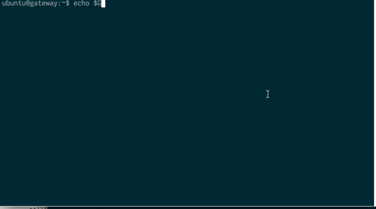

# kcptun
TCP流转换为KCP+UDP流(AES加密)，用于在高丢包环境中，TCP降速严重的问题，工作示意图:      
```
+-----------+--------------+----------------+------------+
|           |              |                |            |
|  Client +--> KCP Client +--> KCP Server +----> Server  |
|           |              |                |            |
+-----------+--------------+----------------+------------+
```
kcptun客户端和服务端分别只有一个main.go文件，非常简单，也方便自己修改。      

# 基于二进制的安装 (使用简单)
在release中下载对应平台的版本， 执行 client -h 和server -h 查看详细使用方法.        
我们以加速ssh访问为例示范使用方法如下：         

1. 假定服务器IP为:```xxx.xxx.xxx.xxx```

2. 服务器端执行:     
```server -t "127.0.0.1:22"  ```     // 所有数据包转发到本地sshd 22端口           

3. 客户端执行:          
```client -r "xxx.xxx.xxx.xxx:29900"   ```    // 连接到远端服务器，默认server端口是29900           

4. 客户端和服务端启动后，使用ssh 连接本地kcptun客户端，即可发起socks通信， 例如:             
```ssh -D 8080 ubuntu@localhost:12948 ```     // 默认的client端口为12948    

5. 浏览器就可以连接8080端口做socks代理了

# 基于源码的安装  (方便使用最新版本)
## 预备条件:       
1. 安装好```golang```       
2. 设置好```GOPATH```  以及```PATH=$PATH:$GOPATH/bin``` (例如: ```export GOPATH=/home/ubuntu;  export PATH=$PATH:$GOPATH/bin```), 最好放到.bashrc 或 .zshrc中 

## 安装命令
1. 服务端: ```go get github.com/xtaci/kcptun/server;  server```        
      

2. 客户端: ```go get github.com/xtaci/kcptun/client;  client```      
    


# 使用案例
1. openvpn client -> kcptun client -> kcptun server -> openvpn server
2. ssh client -> kcptun client -> kcptun server -> sshd
2. browser socks5 proxy(pac) -> kcptun client -> kcptun server -> socks5 server

# 常见问题
Q: client/server都启动了，但无法传输数据        
A: 先杀掉client/server，然后重新启动就能解决绝大部分的问题。      

Q: 出现不明原因降速严重，可能有50%丢包 
A: 可能该端口被运营商限制，KCP C/S 更换一个端口就能解决

# 贡献
欢迎短小精干的PR
